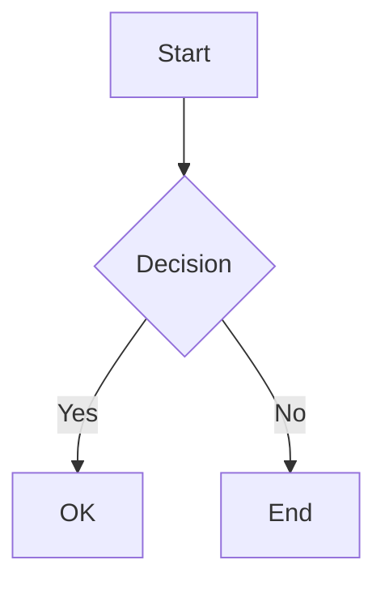

# FixIt + Hugo Markdown Cheat Sheet

## Standard Markdown

```markdown
# Heading 1
## Heading 2
### Heading 3

**bold**   *italic*   ~~strikethrough~~

- bullet list
1. numbered list

[link text](https://example.com)


> blockquote

`inline code`
```

## Extended Syntax (FixIt)

```markdown
++inserted text++              underlined/inserted
~~deleted text~~               strikethrough
==highlighted text==           yellow highlight
==text==[success]              green highlight (also: primary, warning, danger, secondary)
^superscript^                  superscript
~subscript~                    subscript
[Hugo]^(static site gen)       ruby annotation (tooltip text above)
[1]/[2]                        fraction: 1/2
:(fa-solid fa-heart):          Font Awesome icon inline
`#00b1ff`                      color preview circle in inline code
```

## Extended Task Lists

```markdown
- [ ] Unchecked
- [x] Checked
- [-] Cancelled
- [/] In Progress
- [!] Important
- [?] Question
```

## Alerts (GitHub-style blockquotes)

```markdown
> [!NOTE]
> Informational note.

> [!TIP]
> Helpful advice.

> [!WARNING]
> Be careful.

> [!DANGER]
> Critical warning.
```

Available types: `NOTE`, `ABSTRACT`/`TLDR`, `INFO`, `TODO`, `TIP`, `SUCCESS`, `QUESTION`, `WARNING`, `FAILURE`, `DANGER`, `BUG`, `EXAMPLE`, `QUOTE`

Foldable (collapsed by default):

```markdown
> [!TIP]- Click to expand
> Hidden content here.
```

Foldable (open by default):

```markdown
> [!TIP]+ Click to collapse
> Visible content here.
```

## Admonition Shortcode (alternative to alerts)

```markdown

Collapsible tip content.

```

## Code Blocks

````markdown
```js
console.log('basic');
```

```js {title="Example" mode="mac" name="app.js" hl_lines=[2]}
function hello() {
  console.log('highlighted line');
}
```

```js {.is-collapsed}
// collapsed by default, click to expand
```
````

Modes: `classic`, `mac`, `simple`

## Mermaid Diagrams

````markdown

````

## ECharts (Interactive Charts)

````markdown
```echarts
title:
    text: My Chart
xAxis:
    type: category
    data: [Mon, Tue, Wed]
yAxis:
    type: value
series:
    - type: line
      data: [120, 200, 150]
```
````

## Math (KaTeX / MathJax)

```markdown
Inline: $E = mc^2$ or \(E = mc^2\)

Block:
$$
\int_{-\infty}^{\infty} e^{-x^2} dx = \sqrt{\pi}
$$
```

## Tabs

```markdown

  {}
  Content for tab 1.
  {}
  {}
  Content for tab 2.
  {}

```

Tab types: `underline`, `pill`, `card`, `segment`

## Details (Collapsible)

```markdown

Hidden content here.

```

## Enhanced Image

```markdown

```

## Enhanced Link (Card Style)

```markdown

```

## Typing Animation

```markdown

console.log('Hello World');

```

## Custom Styling

```markdown
{{< style "text-align:right; strong{color:#00b1ff;}" >}}
This is **right-aligned** blue bold text.

```

## File Tree

````markdown
```file-tree {level=2}
- name: my-project
  type: dir
  children:
    - name: src
      type: dir
    - name: package.json
      type: file
```
````

## Embeds

```markdown


```

## Tables

```markdown
| Left | Center | Right |
|:-----|:------:|------:|
| a    |   b    |     c |
```

## Footnotes

```markdown
Here is a statement[^1].

[^1]: This is the footnote text.
```

## CSS Utility Classes (via attributes)

```markdown
This paragraph is centered.
{.text-center}
```

Available: `.text-center`, `.text-start`, `.text-end`, `.text-primary`, `.text-success`, `.text-warning`, `.text-danger`, `.text-secondary`

## Encrypted Content

```markdown
{}
Secret content only visible after entering password.
{}
```

## Timeline

````markdown
```timeline
- title: Event 1
  date: 2026-01-01
  content: First event description.
- title: Event 2
  date: 2026-02-01
  content: Second event description.
```
````

## Raw HTML (requires unsafe=true in hugo.toml)

```markdown

<div style="color: red;">Custom HTML here</div>

```
